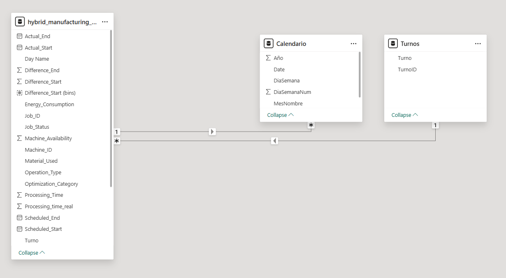
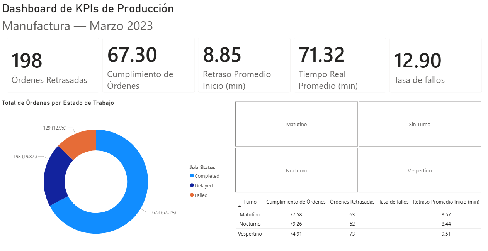
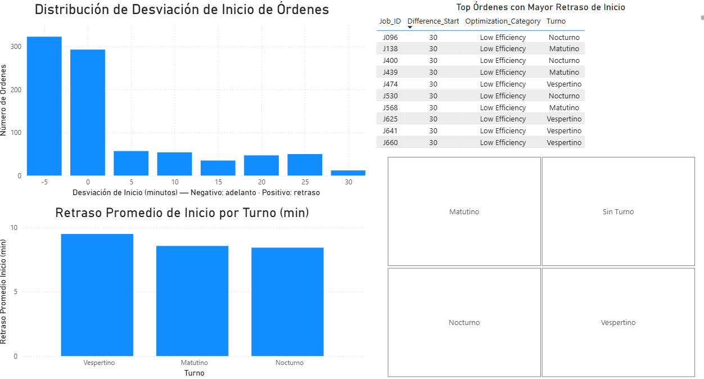

# Dashboard de KPIs de Producción — Manufactura

Dashboard interactivo en Power BI que analiza el desempeño operativo de un proceso de manufactura a partir de datos de órdenes de producción. El proyecto cubre el pipeline completo: limpieza de datos en Power Query, modelado en esquema estrella, cálculo de KPIs con DAX y diseño de reportes ejecutivos. Se busca responder a preguntas concretas de operaciones, cumplimiento de órdenes, puntualidad de arranque, y desempeño por turno.

**Herramientas:** Power BI Desktop · Power Query · DAX · Dataset de Kaggle

---

## 1. Resumen ejecutivo

Este dashboard simula el reporte operativo que un analista entregaría al área de producción de una planta de manufactura, el cual analiza 1,000 órdenes de producción para identificar dónde se concentran los retrasos, qué turno tiene el peor desempeño y si existe relación entre la eficiencia del proceso y la puntualidad de las órdenes.

El proyecto está organizado en dos páginas: un resumen ejecutivo (1° página) con los KPIs principales y la distribución de estatus, y un análisis de desviación de arranque de órdenes (2° página) que profundiza en el comportamiento de los retrasos y los casos extremos.

---

## 2. Fuente de datos

Los datos provienen de un dataset público de Kaggle sobre producción en manufactura, cada fila representa una orden de producción con su estatus, tiempos programados y reales, categoría de eficiencia y métricas de procesamiento. La consulta puede hacerse mediante el siguiente link:
[Manufacturing Production Data](https://www.kaggle.com/datasets/ziya07/manufacturing-production-data) 

**Columnas utilizadas en el análisis:**

- `Job_Status` — estatus de la orden (Completed, Delayed, Failed)
- `Scheduled_Start` / `Scheduled_End` — tiempos programados
- `Actual_Start` / `Actual_End` — tiempos reales de ejecución
- `Difference_Start` — desviación entre inicio real y programado (minutos)
- `Processing_time_real` — tiempo real de procesamiento
- `Optimization_Category` — clasificación de eficiencia (High / Moderate / Low Efficiency)

**Nota técnica sobre el dataset:** Durante la exploración se detectó que la duración planeada y la duración real son idénticas en todos los registros, y que el rango de fechas cubre únicamente 8 días naturales, lo que puede indicar que parcialmente la base de datos es sintética, y en lugar de forzar métricas que el dato no soporta (como análisis de tendencias temporales o desviación de duración), el análisis se reorientó hacia las variables que sí presentan variación real: estatus de las órdenes, desviación de inicio y categoría de eficiencia.

---

## 3. Preguntas de negocio

El análisis se construyó alrededor de preguntas operativas:

1. ¿Qué porcentaje de órdenes se completa, se retrasa o falla?
2. ¿Qué turno (matutino, vespertino, nocturno) tiene el peor desempeño combinado?
3. ¿La mayoría de las órdenes arranca tarde, a tiempo o antes de lo programado?
4. ¿Existe relación entre la eficiencia del proceso y la magnitud del retraso de inicio?

---

## 4. Modelo de datos

El modelo sigue un **esquema estrella** con una tabla de hechos al centro y dos dimensiones que la filtran.

**Tabla de hechos:** `hybrid_manufacturing_categorical` — una fila por orden de producción.

**Dimensiones:**
- `Calendario` — tabla de fechas generada con `CALENDAR()`, con columnas derivadas de año, mes, día de la semana, y marcada como tabla de fechas oficial.
- `Turnos` — dimensión con 4 registros (Sin Turno, Matutino, Vespertino, Nocturno).

**Relaciones:**
- `Calendario[Date]` → `hybrid_manufacturing_categorical[Scheduled_Start]` (uno a muchos)
- `Turnos[TurnoID]` → `hybrid_manufacturing_categorical[TurnoID]` (uno a muchos)

**Decisiones técnicas defendibles:**

- La asignación de turno se construyó como columna calculada usando `HOUR(Scheduled_Start)`, con los rangos 06:00–14:00 (matutino), 14:00–22:00 (vespertino) y resto (nocturno), mientras que las órdenes con estatus Failed —que no tienen hora de inicio válida— se asignaron a un turno "Sin Turno" (TurnoID 0) en lugar de dejarlas en blanco, para evitar valores fantasma en los segmentadores. Además los registros Failed se mantuvieron en el modelo consolidado —en lugar de excluirse— porque representan un KPI independiente (Tasa de Fallos) que enriquece el análisis operativo, y con la finalidad de respetar la integridad de la base de datos. Su separación física habría roto los denominadores de las medidas DAX.
- Las medidas de porcentaje usan `DIVIDE()` en lugar del operador `/` para manejar de forma segura la división por cero.
- La medida de retraso promedio excluye los valores negativos (`Difference_Start >= 0`), ya que un valor negativo representa un arranque anticipado, no un retraso.

**Medidas DAX principales:**

| Medida | Descripción |
|---|---|
| `TasaCumplimiento` | % de órdenes con estatus Completed sobre el total |
| `TasaFallos` | % de órdenes con estatus Failed sobre el total |
| `OrdenesRetrasadas` | Conteo de órdenes con estatus Delayed |
| `RetrasoPromedioInicio` | Promedio de minutos de retraso de inicio (solo valores ≥ 0) |
| `TiempoRealPromedio` | Promedio del tiempo real de procesamiento |

---

## 5. Hallazgos clave

**Distribución de estatus:** De las 1,000 órdenes, el 67.3% se completó, el 19.8% se retrasó y el 12.9% falló. La tasa de fallos coincide exactamente con el número de registros sin tiempos reales detectados en la limpieza, lo que confirma la trazabilidad entre la exploración inicial y el modelo final.

**La operación tiende a anticiparse, no a atrasarse:** Casi dos tercios de las órdenes arrancan antes de lo programado o exactamente a tiempo. Esto contradice la hipótesis inicial de un "problema de retrasos" y reorienta la narrativa hacia la *desviación de inicio* como fenómeno bidireccional (adelantos y retrasos), no solo como atrasos.

**El turno vespertino tiene el peor desempeño combinado:** Presenta el menor cumplimiento (74.9%) y el mayor retraso promedio de inicio (9.51 min), frente al nocturno (79.3% de cumplimiento, 8.44 min de retraso). La diferencia absoluta es de ~1 minuto, pero representa más del 10% de variación relativa entre el mejor y el peor turno.

**Los retrasos extremos coinciden 100% con baja eficiencia:** Las 10 órdenes con mayor desviación de inicio (30 minutos) pertenecen, sin excepción, a la categoría *Low Efficiency*. Esto sugiere que el retraso severo no es aleatorio, sino sistemático en ciertos procesos —un hallazgo accionable para el área de operaciones.

---

## 6. Decisiones de diseño y aprendizajes

**Reorientación del análisis ante limitaciones del dato:** El aprendizaje central fue reconocer cuándo un dato no soporta el análisis planeado. Al detectar que las duraciones planeada y real eran idénticas, se descartó el análisis de desviación de duración y se redirigió el foco hacia métricas con variación genuina. Interpretar el dato honestamente resultó más valioso que forzar una métrica vacía.

**Diagnóstico sistemático de modelado:** Varias decisiones de modelado tuvieron consecuencias en cascada (por ejemplo, separar físicamente los registros Failed rompió los denominadores de las medidas, lo que obligó a reunificar las tablas con Append Queries). El aprendizaje fue pensar el modelo completo antes de actuar, y diagnosticar la causa raíz —datos vs. configuración vs. caché— antes de aplicar correcciones.

**Sparsity como característica, no como error:** Con 1,000 registros distribuidos en 8 fechas, 4 turnos y 3 estatus, muchas combinaciones cruzadas (turno × día) quedan legítimamente sin datos. Reconocer que esto es una limitación de volumen y no un error de modelo llevó a simplificar el dashboard y eliminar segmentaciones que generaban vacíos engañosos.

**Diseño orientado a la decisión:** Cada página responde una pregunta específica en pocos segundos. Se evitó la sobrecarga visual y se excluyeron elementos (como el segmentador de día) que no aportaban valor analítico dado el tamaño del dataset.

---

## 7. Capturas del dashboard

**Página 1 — Resumen Ejecutivo**

**Página 2 — Análisis de Desviación de Inicio**

---

## 8. Estructura del repositorio y reproducción

**Archivos:**
- `Dashboard_KPIs_Produccion.pbix` — archivo principal de Power BI
- **Dataset original:** [Manufacturing Production Data en Kaggle](https://www.kaggle.com/datasets/ziya07/manufacturing-production-data)
- `/img` — capturas del dashboard
- `README.md` — este documento

**Para reproducir:**
1. Descargar el dataset desde https://www.kaggle.com/datasets/ziya07/manufacturing-production-data.
2. Abrir `Dashboard_KPIs_Produccion.pbix` en Power BI Desktop.
3. Actualizar la ruta de la fuente de datos en Power Query si es necesario (`Transform Data` → `Data source settings`).
4. Refrescar el modelo.

---

*Proyecto de portafolio desarrollado como parte de mi formación en análisis de datos aplicado a contextos de ingeniería industrial (manufactura, operaciones, mejora continua).*
